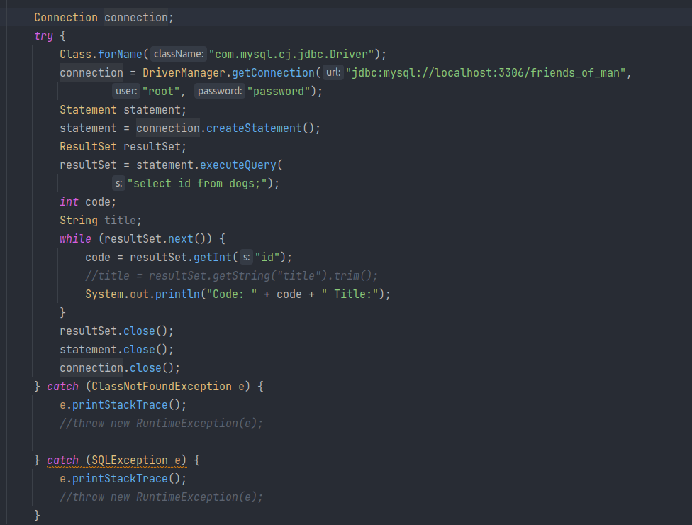
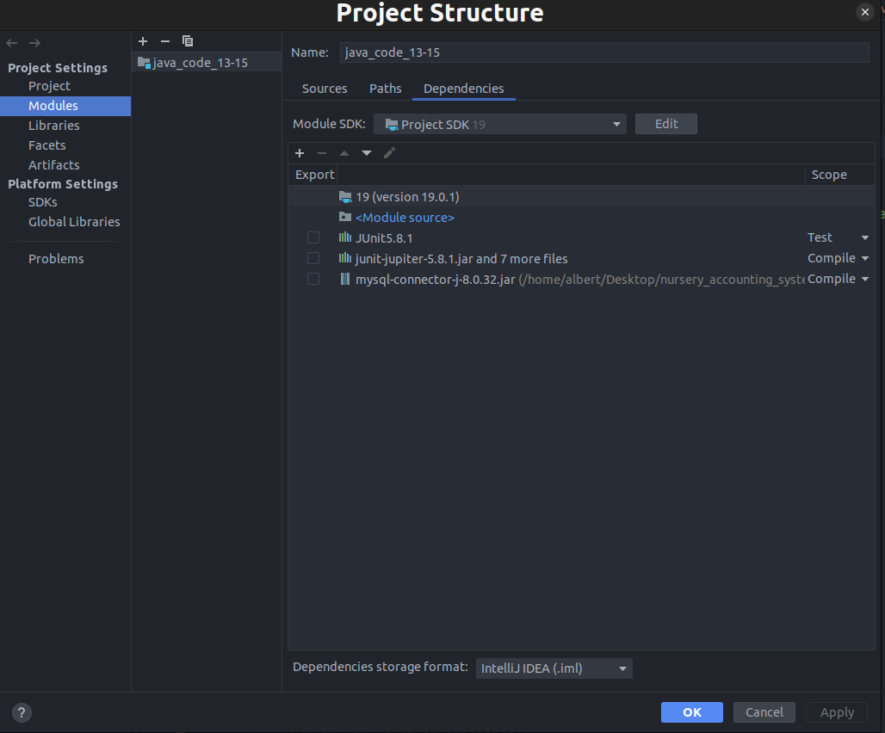

- Commands which I've used

1. Используя команду cat в терминале операционной системы Linux, создать
два файла Домашние животные (заполнив файл собаками, кошками,
хомяками) и Вьючные животными заполнив файл Лошадьми, верблюдами и
ослы), а затем объединить их. Просмотреть содержимое созданного файла.
Переименовать файл, дав ему новое имя (Друзья человека):
```
cat > pets
cat > pack_animals
cat pets pack_animals > merge_animals
cat merge_animals
mv merge_animals mans_friends
```
---

2. Создать директорию, переместить файл туда:
```
mkdir nursery_accounting_system && cd nursery_accounting_system && git init && mv ../mans_friends . ../pack_animals . ../pets . ../README.md .
```
---

3. Подключить дополнительный репозиторий MySQL. Установить любой пакет
из этого репозитория:<br>
https://dev.mysql.com/doc/mysql-apt-repo-quick-guide/en/
```
wget https://dev.mysql.com/get/mysql-apt-config_0.8.24-1_all.deb
sudo dpkg -i mysql-apt-config_0.8.24-1_all.deb
sudo apt-get update
sudo apt-get install mysql-server
```
---

4. Установить и удалить deb-пакет с помощью dpkg:
```
wget https://az764295.vo.msecnd.net/stable/97dec172d3256f8ca4bfb2143f3f76b503ca0534/code_1.74.3-1673284829_amd64.deb
sudo dpkg -i code_1.74.3-1673284829_amd64.deb
sudo dpkg -r code
```
---

5. Выложить историю команд в терминале ubuntu:
```
history
```
---

6. Нарисовать диаграмму, в которой есть класс родительский класс, домашние
животные и вьючные животные, в составы которых в случае домашних
животных войдут классы: собаки, кошки, хомяки, а в класс вьючные животные
войдут: Лошади, верблюды и ослы):<br>
way file -> animals_uml.drawio
---

7. В подключенном MySQL репозитории создать базу данных “Друзья
человека”:
---
v.sql
8. Создать таблицы с иерархией из диаграммы в БД:
---
v.sql
9. Заполнить низкоуровневые таблицы именами(животных), командами
которые они выполняют и датами рождения
v.sql
---

10. Удалив из таблицы верблюдов, т.к. верблюдов решили перевезти в другой питомник на зимовку. Объединить таблицы лошади, и ослы в одну таблицу.
v.sql

11. Создать новую таблицу “молодые животные” в которую попадут все
животные старше 1 года, но младше 3 лет и в отдельном столбце с точностью
до месяца подсчитать возраст животных в новой таблице

12. Объединить все таблицы в одну, при этом сохраняя поля, указывающие на
прошлую принадлежность к старым таблицам.

---
13. Создать класс с Инкапсуляцией методов и наследованием по диаграмме.

14. Написать программу, имитирующую работу реестра домашних животных.
В программе должен быть реализован следующий функционал:
14.1 Завести новое животное
14.2 определять животное в правильный класс
14.3 увидеть список команд, которое выполняет животное
14.4 обучить животное новым командам
14.5 Реализовать навигацию по меню
15. Создайте класс Счетчик, у которого есть метод add(), увеличивающий̆
значение внутренней̆ int переменной̆ на 1 при нажатии “Завести новое
животное” Сделайте так, чтобы с объектом такого типа можно было работать в
блоке try-with-resources. Нужно бросить исключение, если работа с объектом
типа счетчик была не в ресурсном try и/или ресурс остался открыт. Значение
считать в ресурсе try, если при заведении животного заполнены все поля.
---

# For connect mysql <br>
- example code

- add dependency
